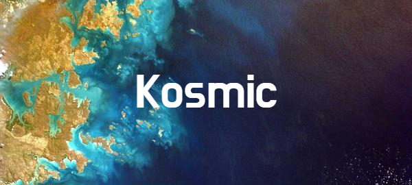

## Testing

Tramite emulatore e/o expo app direttamente sul proprio dispositivo android.

| **Commands** |
| :--------------------------------- |
| **1.** `git clone NotFiliberto/Kosmic` |
| **2.** `npm run install` |
| **3.** `npm run android` |

Crea un file `.env` nella root principale del progetto e inserisci l' API_KEY di google maps per far funzionare la mappa. (Puoi modificare il file .env.example, e poi rinominarlo in: ".env")

Nota: Se vuoi testare l'applicazione direttamente sul tuo dispositivo, installa [Expo Go](https://expo.dev/client) e dopo aver seguito i passaggi sopra riportati, scansiona il QR code mostrato sul terminale con il tuo dispositivo.

## Features

| Feature | Description |
| :-------| :---------- |
| View map through Google API 🗺️ | -- |
| View light-pollution stats 🏙️ | -- |
| Search places in Veneto area 🔍 | -- |
| Add places as favourite in local device storage ❤️ | -- |
| Astronomic events section 🌠 🌑 🌓 🌔 🌕 | -- |
| Astronomic Event notifier 📱 | -- |
